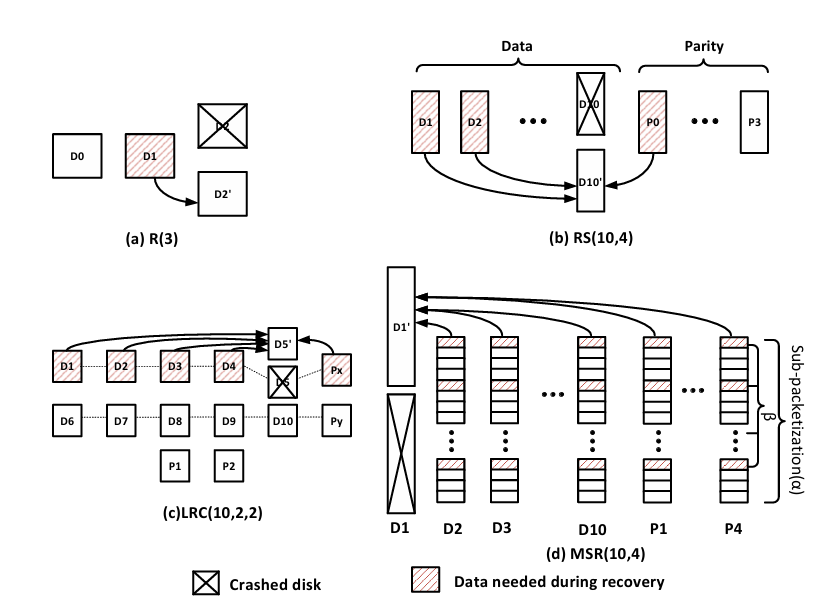
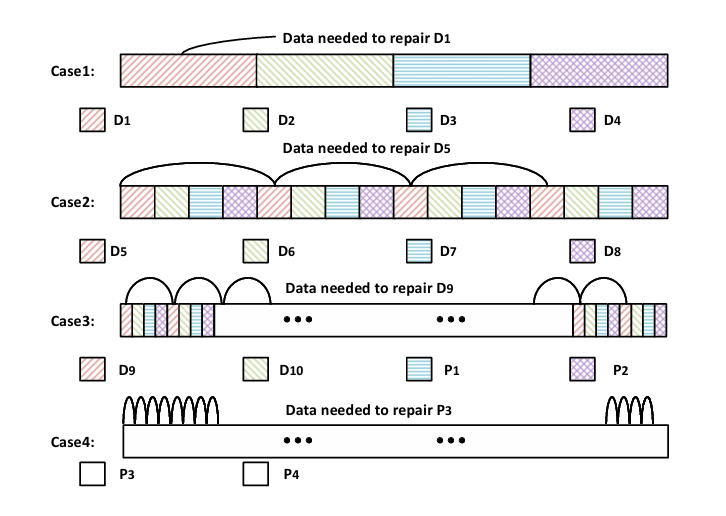

## Challenge

MSR (Minimum Storage Regenerating) 在同样的存储效率与可靠性保证下实现了**最优化**的修复花费（需求最少的数据量）。

最重要的，MSR 区别于 RS 的一点是：MSR 的修复以**块**为单位的，而 RS 则可以以**字节**为单位的。

在分布式存储系统中，数据以 ChunkSize 的大小被分割组织在存储系统中，n=k+m 个 chunk 被共同编码。在 MSR 中，一个 chunk 又被分为 α 个 sub-chunk，修复一个 chunk 时，需从 d（k<d<n）个节点的共同编码 chunk 的 α 个 sub-chunk 中再提取出 β 个 sub-chunk 用于恢复。（α 和 β 取较小值更加符合局部性）

除开 α 与 β 大小的选择，ChunkSize 的选择也同样重要。

1. 较大的 ChunkSize 有利于恢复，原因是可以充分发挥磁盘 IO 性能
   > To repair a chunk, you need to read 64 sub-chunks, which are 16 discontinuous reads, and the I/O size of each read is the size of 4 sub-chunks. If the I/O size is 4KB and the size of sub-chunk is 1KB, the cor responding chunk size will be 4KB × 64 = 256KB. For case 4, the corresponding chunk size is as large as 1MB. Any chunk size smaller than that will result in reduced performance.
2. 过大的 ChunkSize 又会从两方面损耗性能：1) 降级读放大；2) 延迟过高
3. 较小的 ChunkSize 反之有利于减小延迟（基于流水线技术）
   

这种利用离散子块恢复的机制，是导致一切问题的根源。

1. 修复子块之间离散，无法充分利用磁盘 I/O 以及 OS 层面的优化
2. 即使在有聚合的情况下，由于对象与编码 chunk 的非对齐行为，将会导致读放大(read amplification)的问题

> [!NOTE]
> 在 MSR 编码下可能导致读放大(read amplification)的行为：
>
> 1.  读取尺寸与 ChunkSize 未对齐
> 2.  聚合对象边界与 ChunkSize 未对齐

> [!NOTE]
> 关于聚合的实现有两种，一种是在**编码层面**的聚合，另外一种是在**对象层面**的聚合。
>
> 编码层面聚合是指，对象被直接存取，但是在编码时会根据 chunkSize 与其他对象共同编码；对象层面的聚合是指，对象与其他对象在存入时，会被记作为单一的对象存入，涉及到缓存池的设计问题，还要引入辅助映射机制来帮助对象的寻址。
>
> 在不同的布局下，两种行为存在些许区别。例如在连续布局下(Contiguous Layout)，两者无太多区别；而对于条带布局(Stripe Layout)，编码层面的聚合，可能会引入些许的 Padding，而对象层面的聚合，对象之间将不存在 Padding。
>
> 

## Solution

作者提出了一种名为 Geometric Partitioning 的对象布局方式，思想简而言之，就是将文件对象基于一定基数的倍数进行划分，分别放置在各个“buket”中，非对齐的头部部分单独放置在一个“buket”中，前者和后者分别采用 MSR 编码（在文章中具体为 Clay 码）与 RS 编码，这种方式有助于 pipeline，降低延迟，并且可以充分发挥磁盘 IO。

